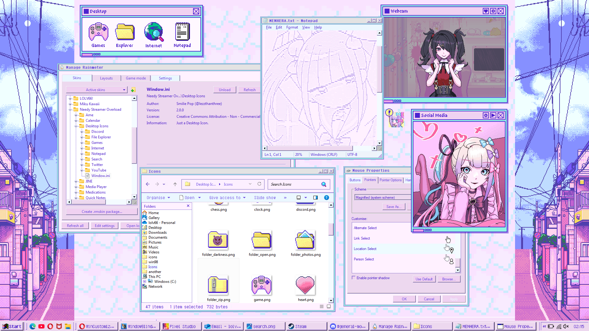
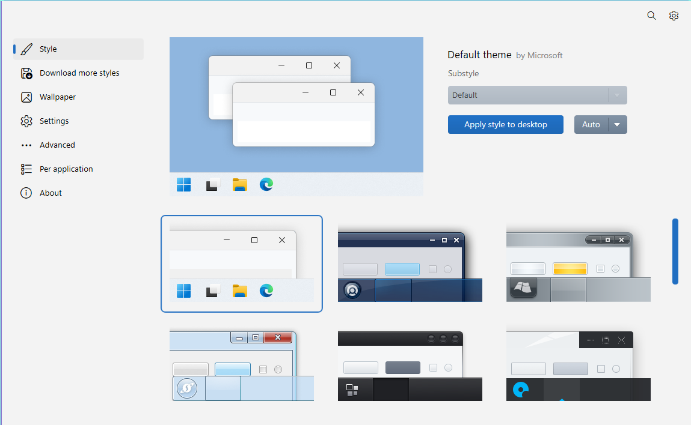
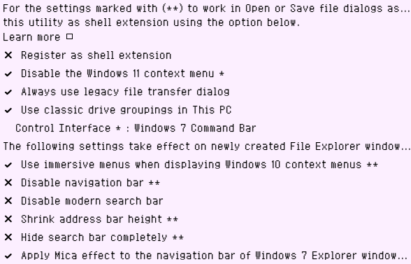

<h1>Windose20</h1>
A Windows 98 theme inspired by the game "Needy Streamer Overload".

<h> stuff that you will need </h>
<ul>
<li><a href="https://www.stardock.com/products/windowblinds">Windowblinds</a></li>
<li><a href="https://github.com/valinet/ExplorerPatcher">Explorer Patcher</a></li>
<li><a href="https://github.com/SolidZORO/zpix-pixel-font">Zpix Font</a></li>
</ul>
<h>optional <i>(but increases the NSO-look of your desktop!! >w<)</i></h>
<ul>
<li><a href="https://github.com/lezzthanthree/Needy-Streamer-Overload">NSO Rainmeter skins</a></li>
<li><a href="https://github.com/Open-Shell/Open-Shell-Menu">OpenShell Startmenu</a></li>
<li><a href="https://github.com/dremin/RetroBar">RetroBar</a></li>
<li><a href="https://winaerotweaker.com">Winaero Tweaker</a></li> 
</ul>
(a tutorial on how to install all of this is <a href="https://www.reddit.com/r/NeedyStreamerOverload/comments/17vxol0/ultimate_nso_desktop_theme_guide_windows">here!</a>)
   
   
<H> HOW TO INSTALL </H>
<pre>
<b>1.</b> <h>Installing Windowblinds</h>
Go to <a href="https://www.stardock.com/products/windowblinds">https://www.stardock.com/products/windowblinds</a>
and click "Get it now". Afterwards, click "try free for 30-days" (or click "get it now" again if you have the money).
Once downloaded, Run  it and will show you the 30-day free trial thingy again, click it and then enter your email and follow the steps afterwards.
 
<b>2.</b> <h>Installing the theme</h>
After following the steps above, double click the WBA file (Windose20.wba) and you will be notified that new theme has been installed.
Go onto Windowblinds and you'll see this page 

Scroll down, click my theme then click and "Apply style to desktop"
You're all ready !! ꉂ(˵˃ ᗜ ˂˵)
 
<b>3.</b> <h>Explorer patcher settings</h>

  
</pre>
